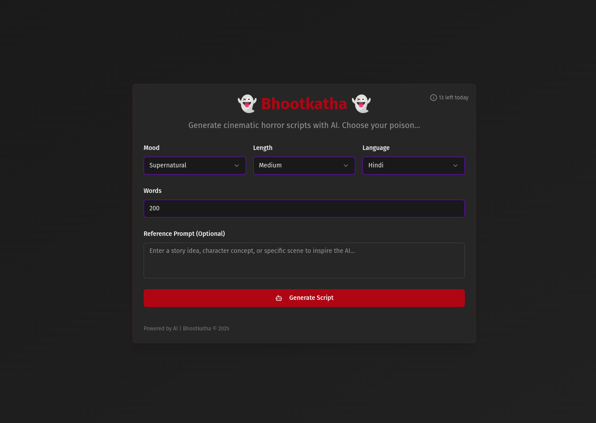

> [!Note]
Note: This web app is build using the Firebase Studio. For generating stories I used the Gemini API Key. You can fork this repo and use or modify as you want, but gives a star first, if you like it, I added a preview link of this tool. But you will only get the 15 generation per day, because, this is run on Free Gemini Model.

## Preview

# **App Name**: Bhootkatha

## Core Features:

- AI Horror Script Generator: Generate horror scripts in Hindi, following a cinematic style with visual and sensory details. The AI tool incorporates story hooks like gripping openers and cliffhangers. The AI is trained on horror-specific themes such as ghosts, rural legends, and suspense.
- Custom Controls: Allow users to customize the mood (Psychological, Supernatural, Gore, Thriller, Paranormal Mystery) and length (Short, Medium, Long) of the generated script using dropdowns or sliders.
- Image Segment Generator: Divide the generated story into segments and generate detailed image prompts for each segment, including scene settings, character descriptions, face consistency prompts, and mood/tone. Display these prompts in a structured list.

## Style Guidelines:

- Primary color: Dark gray (#333333) to set a somber mood.
- Secondary color: Blood red (#8B0000) for highlights and important actions.
- Accent: Deep purple (#4B0082) for interactive elements.
- Creepy and slightly distressed fonts for titles to enhance the horror theme.
- Use a dark theme with high contrast to create a sense of unease.
- Implement smooth, eerie loading animations for story generation and visual scene creation to build suspense.

## Original User Request:
🔥 Firebase Studio Prompt: Hindi Horror Script Generator Web App
Project Title:
Hindi Horror Script Generator with Cinematic AI Hooks and Image Scenes

📌 App Overview:
Build a web application where users can generate horror scripts in Hindi using AI, focused on cinematic writing styles. Users can customize tone (mood) and length, and receive scene-by-scene image prompts with face consistency for visuals. It should also allow easy copying of scripts.

🛠️ Features & Functional Requirements:
1. AI Horror Script Generator (Hindi)
Generate AI-written horror stories in pure Hindi, including dialogues.

Story must follow a cinematic writing style with visual and sensory detail.

Integrate story "hooks": gripping openers, cliffhangers, and twists.

AI model trained or prompted for horror-specific themes (ghosts, rural legends, suspense, etc.).

2. Custom Controls
Mood Selector: Dropdown or slider with options like:

Psychological

Supernatural

Gore

Thriller

Paranormal Mystery

Length Selector: Radio or slider with:

Short (2-3 mins read)

Medium (5-7 mins)

Long (10+ mins)

3. Story Display & Copy
Display final story in a readable, styled text block.

Include a "Copy Story" button with visual feedback (like a checkmark on success).

4. Image Segment Generator
Button: "Generate Visual Scenes" after script generation.

When clicked, app divides story into minimum 20 segments.

For each segment:

Extract the scene or event.

Generate a highly detailed image prompt for AI image tools (like Midjourney, DALL·E).

Prompt includes:

Scene setting (location, lighting, time of day)

Character descriptions

Face consistency prompt: “same face as previous”, describe face features.

Mood/tone (dark, foggy, tense)

Display or download all prompts in a structured list.

💻 Tech Stack Suggestions
Frontend: React.js or Next.js with Tailwind CSS

Backend: Firebase Functions for AI calls

AI: OpenAI (gpt-4-turbo for text, DALL·E for image prompts)

Database: Firebase Firestore for storing generated scripts and prompts

Auth (Optional): Firebase Auth if saving user sessions

🎨 Design Hints
Dark theme UI (blacks, blood reds, deep grays)

Creepy fonts for titles

Smooth, eerie loading animations for story generation and visual scenes

✅ Deliverables
Hindi horror script writer page with mood and length selector

Button to generate story

Button to copy script

Button to generate visual prompts (min 20)

Exportable prompt list with face consistency maintained
  